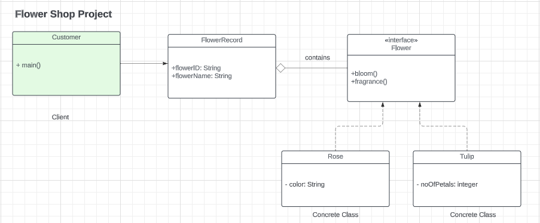

## Problem Scenario
Implement factory design pattern using Flower as the factory interface. The interface implements two methods: bloom() and fragrance().

Rose and Tulip are concrete objects that implements Flower interface.

FlowerRecord holds attributes such as flowerId, flowerName, and Flower.

Customer would be the client object.

Refer to the UML Class Diagram

## UML Class Diagram

